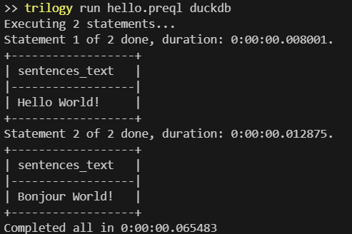

## Trilogy
[](https://trilogydata.dev/)
[](https://discord.gg/Z4QSSuqGEd)

pytrilogy is an experimental implementation of the Trilogy language, a higher-level SQL that replaces tables/joins with a lightweight semantic binding layer.

Trilogy looks like SQL, but simpler. It's a modern SQL refresh targeted at SQL lovers who want reusability and simplicity with the power and iteratability of SQL. It compiles to SQL - making it easy to debug or integrate into existing workflows - and can be run against any supported SQL backend.  

> [!TIP]
> To get an overview of the language and run interactive examples, head to the [documentation](https://trilogydata.dev/).

Installation: `pip install pytrilogy`

`pytrilogy` can be run locally to parse and execute trilogy model [.preql] files using the `trilogy` CLI tool, or can be run in python by importing the `trilogy` package.

You can read more about the project [here](https://trilogydata.dev/) and try out an interactive demo [here](https://trilogydata.dev/demo/). 

Trilogy:
```sql
WHERE 
    name like '%lvis%'
SELECT
    name,
    count(name) as name_count
ORDER BY
    name_count desc
LIMIT 10;
```
## Goals
vs SQL, the goals are:

Preserve:
- Correctness
- Accessibility

Enhance:
- Simplicity
- Understandability
- Refactoring/mantainability
- Reusability

Maintain:
- Acceptable performance

## Hello World

Save the following code in a file named `hello.preql`

```python
key sentence_id int;
property sentence_id.word_one string; # comments after a definition 
property sentence_id.word_two string; # are syntactic sugar for adding
property sentence_id.word_three string; # a description to it

# comments in other places are just comments

# define our datasources as queries in duckdb
datasource word_one(
    sentence: sentence_id,
    word:word_one
)
grain(sentence_id)
query '''
select 1 as sentence, 'Hello' as word
union all
select 2, 'Bonjour'
''';

datasource word_two(
    sentence: sentence_id,
    word:word_two
)
grain(sentence_id)
query '''
select 1 as sentence, 'World' as word
union all
select 2 as sentence, 'World'
''';

datasource word_three(
    sentence: sentence_id,
    word:word_three
)
grain(sentence_id)
query '''
select 1 as sentence, '!' as word
union all
select 2 as sentence, '!'
''';

# an actual select statement
# joins are automatically resolved between the 3 sources
with sentences as
select sentence_id, word_one || ' ' || word_two ||  word_three as text;

SELECT
    --sentences.sentence_id,
    sentences.text
WHERE 
    sentences.sentence_id = 1
;

SELECT
    --sentences.sentence_id,
    sentences.text
WHERE 
    sentences.sentence_id = 2
;
# semicolon termination for all statements

```

Run the following from the directory the file is in.

```bash
trilogy run hello.trilogy duckdb
```



## Backends

The current Trilogy implementation supports these backends:

- Bigquery
- SQL Server
- DuckDB
- Snowflake

## Basic Example - Python

Trilogy can be run directly in python through the core SDK. Trilogy code can be defined and parsed inline or parsed out of files.

A bigquery example, similar to bigquery [the quickstart](https://cloud.google.com/bigquery/docs/quickstarts/query-public-dataset-console).

```python


from trilogy import Dialects, Environment

environment = Environment()

environment.parse('''

key name string;
key gender string;
key state string;
key year int;
key yearly_name_count int; int;


datasource usa_names(
    name:name,
    number:yearly_name_count,
    year:year,
    gender:gender,
    state:state
)
address bigquery-public-data.usa_names.usa_1910_2013;

'''
)
executor = Dialects.BIGQUERY.default_executor(environment=environment)

results = executor.execute_text(
'''SELECT
    name,
    sum(yearly_name_count) -> name_count 
WHERE
    name = 'Elvis'
ORDER BY
    name_count desc
LIMIT 10;
'''

)
# multiple queries can result from one text batch
for row in results:
    # get results for first query
    answers = row.fetchall()
    for x in answers:
        print(x)
```


## Basic Example - CLI

Trilogy can be run through a CLI tool, also named 'trilogy'.

After installing trilogy, you can run the trilogy CLI with two required positional arguments; the first the path to a file or a direct command,
and second the dialect to run.

`trilogy run <cmd or path to trilogy file> <dialect>`

To pass arguments to a backend, append additional --<option> flags after specifying the dialect.

Example:
`trilogy run "key x int; datasource test_source ( i:x) grain(in) address test; select x;" duckdb --path <path/to/database>`

### Bigquery Args
N/A, only supports default auth. In python you can pass in a custom client.
<TODO> support arbitrary cred paths. 

### DuckDB Args
- path <optional>

### Postgres Args
- host
- port
- username
- password
- database

### Snowflake Args
- account
- username
- password


> [!TIP]
> The CLI can also be used for formatting. Trilogy has a default formatting style that should always be adhered to. `trilogy fmt <path to trilogy file>`


## More Examples

[Interactive demo](https://trilogydata.dev/demo/). 

Additional examples can be found in the [public model repository](https://github.com/trilogydata/trilogy-public-models).

This is a good place to look for modeling examples.

## Developing

Clone repository and install requirements.txt and requirements-test.txt.

## Contributing

Please open an issue first to discuss what you would like to change, and then create a PR against that issue.

## Similar in space
Trilogy combines two aspects; a semantic layer and a query language. Examples of both are linked below:

Python "semantic layers" are tools for defining data access to a warehouse in a more abstract way.

- [metricsflow](https://github.com/dbt-labs/metricflow)

"Better SQL" has been a popular space. We believe Trilogy takes a different approach then the following,
but all are worth checking out. Please open PRs/comment for anything missed!

- [malloy](https://github.com/malloydata/malloy)
- [preql](https://github.com/erezsh/Preql)
- [PREQL](https://github.com/PRQL/prql)

## Minimal Syntax Reference

#### IMPORT

`import [path] as [alias];`

#### CONCEPT

Types: `string | int | float | bool | date | datetime | time | numeric(scale, precision) | timestamp | interval | list<[type]> | map<[type], [type]> | struct<name:[type], name:[type]>`;

Key:
`key [name] [type];`

Property:
`property [key>].[name] [type];`
`property x.y int;`
or 
`property <[key](,[key])?>.<name> [type];`
`property <x,y>.z int;`


Transformation:
`auto [name] <- [expression];`
`auto x <- y + 1;`

#### DATASOURCE
```sql
datasource <name>(
    <column>:<concept>,
    <column>:<concept>,
)
grain(<concept>, <concept>)
address <table>;
```

#### SELECT

Primary acces

```sql
select
    <concept>,
    <concept>+1 -> <alias>
WHERE
    <concept> = <value>
ORDER BY
    <concept> asc|desc
;
```

#### CTE/ROWSET

Reusable virtual set of rows. Useful for windows, filtering. 

```sql
with <alias> as
select
    <concept>,
    <concept>+1 -> <alias>
WHERE
    <concept> = <value>

select <alias>.<concept>;

```


#### PERSIST

Store output of a query in a warehouse table

```sql
persist <alias> as <table_name> from
<select>;
```

#### SHOW

Return generated SQL without executing.

```sql
show <select>;
```