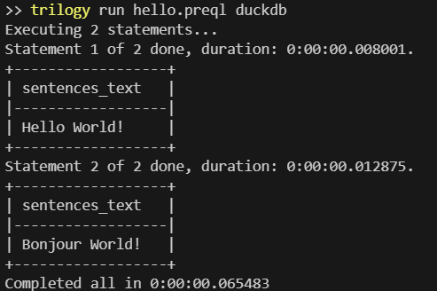

# Trilogy
**SQL with superpowers for analytics**

[](https://trilogydata.dev/)
[](https://discord.gg/Z4QSSuqGEd)
[](https://badge.fury.io/py/pytrilogy)

Trilogy is a batteries-included data-productivity toolkit to accelerate traditional SQL tasks - reporting, data processing,
and adhoc analytics. It's great for humans - and even better for agents. 

The language - also called Trilogy - lets you write queries without manual joins, reuse and compose logic,
and get type-checked, safe SQL for any supported backend.

The rich surrounding ecosystem - CLI, studio, public models, python datasource integration - let you move fast. 

## Why Trilogy

SQL is easy to start with and hard to scale.

Trilogy adds a lightweight semantic layer to keep the speed, but make it 
faster at scale. 

- No manual joins; no from clause
- Reusable models, calculations, and functions
- Safe refactoring across queries
- Works where analytics lives: BigQuery, DuckDB, Snowflake, Presto
- Easy to write - for humans and AI
- Built-in semantic layer without boilerplate or YAML

This repo contains [pytrilogy](https://github.com/trilogy-data/pytrilogy), the reference implementation of the core language and cli.

**Install**
To try it out, include both the CLI and serve dependencies.

```bash
pip install pytrilogy[cli,serve]
```

## Docs and Web

> [!TIP]
> **Try it now:** [Open-source studio](https://trilogydata.dev/trilogy-studio-core/) | [Interactive demo](https://trilogydata.dev/demo/) | [Documentation](https://trilogydata.dev/)


### Quick Start

Go from zero to a queryable, persisted model in seconds. We'll pull a
public DuckDB model (some 2000s USA FAA airplane data, hosted parquet), add a
derived persisted datasource, refresh it, then explore it in Studio.

```bash
# 1. Pull a public model (fetches all source .preql + setup.sql + trilogy.toml).
trilogy public fetch faa ./faa-demo
cd faa-demo

# Run a quick adhoc query (--import prepends the import for you — discover
# what's available with `trilogy explore flight.preql`)
trilogy run --import flight "select carrier.code, count(id) as flight_count order by flight_count desc;"


# Plot it
trilogy run --import flight "chart layer barh ( y_axis <- carrier.name, x_axis <- count(id) as flight_count ) order by flight_count desc limit 10
layer barh (y_axis <-carrier.name, x_axis <-count(aircraft.id) as airplane_count) order by airplane_count desc limit 10
;"

# 3. Add a derived datasource by grabbing the hosted snippet
trilogy file write reporting.preql --from-url https://raw.githubusercontent.com/trilogy-data/trilogy-public-models/refs/heads/main/examples/duckdb/faa/example.preql

# 4. Refresh — runs setup.sql, builds any managed assets, tracks watermarks.
trilogy refresh .

# 5. Launch the Studio UI against the live model (opens your browser) to explore + query
trilogy serve .
```

The snippet fetched in step 3 looks like this — copy/paste it into your
editor if you'd rather author it by hand:

```trilogy
import flight as flight;

# derive reusable concepts
auto flight_date <- flight.dep_time::date;

# this can be properties or metrics
auto flight_count <- count(flight.id);

# datasources can be read from or written to
# use this to write to 
datasource daily_airplane_usage (
    flight_date,
    flight.aircraft.model.name,
    flight_count
)
grain(flight_date, flight.aircraft.model.name)
address daily_airplane_usage
;
```

Browse other available models with `trilogy public list` (filter with
`--engine duckdb` or `--tag benchmark`). Every model in
[trilogy-public-models](https://github.com/trilogy-data/trilogy-public-models)
is pullable.


### Key Features

Trilogy supports reusable functions.
Where clauses are automatically pushed down inside aggregates;
having filters the otuside.
```sql
const prime <- unnest([2, 3, 5, 7, 11, 13, 17, 19, 23, 29]);

def cube_plus_one(x) -> (x * x * x + 1);
def sum_plus_one(val)-> sum(val)+1;

WHERE 
   (prime+1) % 4 = 0
SELECT
    @sum_plus_one(@cube_plus_one(prime)) as prime_cubed_plus_one_sum_plus_one
LIMIT 10;
```

**Run it in DuckDB**
```bash
trilogy run hello.preql duckdb
```

## Principles

Versus SQL, Trilogy aims to: 

**Keep:**
- Correctness
- Accessibility

**Improve:**
- Simplicity
- Refactoring/maintainability
- Reusability/composability
- Expressivness

**Maintain:**
- Acceptable performance

(we shoot for <~100-300ms of overhead for queyr planning, and optimized SQL generation)

## Backend Support

| Backend | Status | Notes |
|---------|--------|-------|
| **BigQuery** | Core | Full support |
| **DuckDB** | Core | Full support |
| **Snowflake** | Core | Full support |
| **Sqlite** | Core | Full support |
| **SQL Server** | Experimental | Limited testing |
| **Presto** | Experimental | Limited testing |

## Semantic Layer Intro

### Semantic models are compositions of types, keys, and properties

Save the following code in a file named `hello.preql`

```python
# semantic model is abstract from data

type word string; # types can be used to provide expressive metadata tags that propagate through dataflow

key sentence_id int;
property sentence_id.word_one string::word; # comments after a definition 
property sentence_id.word_two string::word; # are syntactic sugar for adding
property sentence_id.word_three string::word; # a description to it

# comments in other places are just comments

# define our datasource to bind the model to data
# for most work, you can import something already defined
# testing using query fixtures is a common pattern
datasource word_one(
    sentence: sentence_id,
    word:word_one
)
grain(sentence_id)
query '''
select 1 as sentence, 'Hello' as word
union all
select 2, 'Bonjour'
''';

datasource word_two(
    sentence: sentence_id,
    word:word_two
)
grain(sentence_id)
query '''
select 1 as sentence, 'World' as word
union all
select 2 as sentence, 'World'
''';

datasource word_three(
    sentence: sentence_id,
    word:word_three
)
grain(sentence_id)
query '''
select 1 as sentence, '!' as word
union all
select 2 as sentence, '!'
''';

def concat_with_space(x,y) -> x || ' ' || y;

# an actual select statement
# joins are automatically resolved between the 3 sources
with sentences as
select sentence_id, @concat_with_space(word_one, word_two) || word_three as text;

WHERE 
    sentences.sentence_id in (1,2)
SELECT
    sentences.text
;
```

**Run it:**
```bash
trilogy run hello.preql duckdb
```



### Python SDK Intro

Trilogy can be run directly in python through the core SDK. Trilogy code can be defined and parsed inline or parsed out of files.

A BigQuery example, similar to the [BigQuery quickstart](https://cloud.google.com/bigquery/docs/quickstarts/query-public-dataset-console):

```python
from trilogy import Dialects, Environment

environment = Environment()

environment.parse('''
key name string;
key gender string;
key state string;
key year int;
key yearly_name_count int; int;

datasource usa_names(
    name:name,
    number:yearly_name_count,
    year:year,
    gender:gender,
    state:state
)
address `bigquery-public-data.usa_names.usa_1910_2013`;
''')

executor = Dialects.BIGQUERY.default_executor(environment=environment)

results = executor.execute_text('''
WHERE
    name = 'Elvis'
SELECT
    name,
    sum(yearly_name_count) -> name_count 
ORDER BY
    name_count desc
LIMIT 10;
''')

# multiple queries can result from one text batch
for row in results:
    # get results for first query
    answers = row.fetchall()
    for x in answers:
        print(x)
```

### LLM Usage

Connect to your favorite provider and generate queries with confidence and high accuracy.

```python
from trilogy import Environment, Dialects
from trilogy.ai import Provider, text_to_query
import os

executor = Dialects.DUCK_DB.default_executor(
    environment=Environment(working_path=Path(__file__).parent)
)

api_key = os.environ.get(OPENAI_API_KEY)
if not api_key:
    raise ValueError("OPENAI_API_KEY required for gpt generation")
# load a model
executor.parse_file("flight.preql")
# create tables in the DB if needed
executor.execute_file("setup.sql")
# generate a query
query = text_to_query(
    executor.environment,
    "number of flights by month in 2005",
    Provider.OPENAI,
    "gpt-5-chat-latest",
    api_key,
)

# print the generated trilogy query
print(query)
# run it
results = executor.execute_text(query)[-1].fetchall()
assert len(results) == 12

for row in results:
    # all monthly flights are between 5000 and 7000
    assert row[1] > 5000 and row[1] < 7000, row

```

### CLI Usage

Trilogy can be run through a CLI tool, also named 'trilogy'.

**Basic syntax:**
```bash
trilogy run <cmd or path to trilogy file> <dialect>
```

**With backend options:**
```bash
trilogy run "key x int; datasource test_source(i:x) grain(x) address test; select x;" duckdb --path <path/to/database>
```

**Format code:**
```bash
trilogy fmt <path to trilogy file>
```

**Browse and pull public models:**
```bash
trilogy public list [--engine duckdb] [--tag benchmark]
trilogy public fetch <model-name> [<dir>] [--no-examples]
```

Fetches model source files, setup scripts, and a ready-to-use `trilogy.toml`
from [trilogy-public-models](https://github.com/trilogy-data/trilogy-public-models)
into a local directory so you can immediately `refresh` and `serve` it.

### Managing workspace files from the CLI

`trilogy file` has shell-agnostic CRUD operations on the filesystem.

```bash
trilogy file list .                      # list entries (-r for recursive, -l for size)
trilogy file read reporting.preql        # dump contents to stdout
trilogy file write path --content "..."  # create/overwrite from a string
trilogy file write path --from-file src  # copy from a local file
trilogy file write path --from-url URL   # fetch from http(s):// or file:// URL
trilogy file delete path --recursive     # remove a file or directory
trilogy file move old.preql new.preql    # rename within a backend
trilogy file exists path                 # exit 0 if present, 1 otherwise
```

#### Backend Configuration

**BigQuery:**
- Uses applicationdefault authentication (TODO: support arbitrary credential paths)
- In Python, you can pass a custom client

**DuckDB:**
- `--path` - Optional database file path

**Postgres:**
- `--host` - Database host
- `--port` - Database port  
- `--username` - Username
- `--password` - Password
- `--database` - Database name

**Snowflake:**
- `--account` - Snowflake account
- `--username` - Username
- `--password` - Password

## Config Files
The CLI can pick up default configuration from a config file in the toml format. 
Detection will be recursive form parent directories of the current working directory,
including the current working directory.

This can be used to set
- default engine and arguments
- parallelism for execute for the CLI
- any startup commands to run whenever creating an executor.

```toml
# Trilogy Configuration File
# Learn more at: https://github.com/trilogy-data/pytrilogy

[engine]
# Default dialect for execution
dialect = "duck_db"

# Parallelism level for directory execution
# parallelism = 2

# Startup scripts to run before execution
[setup]
# startup_trilogy = []
sql = ['setup/setup_dev.sql']
```

## More Resources

- [Interactive demo](https://trilogydata.dev/demo/)
- [Public model repository](https://github.com/trilogydata/trilogy-public-models) - Great place for modeling examples
- [Full documentation](https://trilogydata.dev/)

## Python API Integration

### Root Imports

Are stable and should be sufficient for executing code from Trilogy as text.

```python
from pytrilogy import Executor, Dialect
```

### Authoring Imports

Are also stable, and should be used for cases which programatically generate Trilogy statements without text inputs
or need to process/transform parsed code in more complicated ways.

```python
from pytrilogy.authoring import Concept, Function, ...
```

### Other Imports

Are likely to be unstable. Open an issue if you need to take dependencies on other modules outside those two paths. 

## MCP/Server

Trilogy is straightforward to run as a server/MCP server; the former to generate SQL on demand and integrate into other tools, and MCP
for full interactive query loops.

This makes it easy to integrate Trilogy into existing tools or workflows.

You can see examples of both use cases in the trilogy-studio codebase [here](https://github.com/trilogy-data/trilogy-studio-core)
and install and run an MCP server directly with that codebase.

If you're interested in a more fleshed out standalone server or MCP server, please open an issue and we'll prioritize it!

## Trilogy Syntax Reference 

See [documentation](https://trilogydata.dev/) for more details.

## Contributing

Clone repository and install requirements.txt and requirements-test.txt.

Please open an issue first to discuss what you would like to change, and then create a PR against that issue.

## Similar Projects

Trilogy combines two aspects: a semantic layer and a query language. Examples of both are linked below:

**Semantic layers** - tools for defining a metadata layer above SQL/warehouse to enable higher level abstractions:
- [MetricFlow](https://github.com/dbt-labs/metricflow)
- [Cube](https://github.com/cube-js/cube)  
- [Zillion](https://github.com/totalhack/zillion)

**Better SQL** has been a popular space. We believe Trilogy takes a different approach than the following, but all are worth checking out. Please open PRs/comment for anything missed!
- [Malloy](https://github.com/malloydata/malloy)
- [Preql](https://github.com/erezsh/Preql)
- [PRQL](https://github.com/PRQL/prql)
